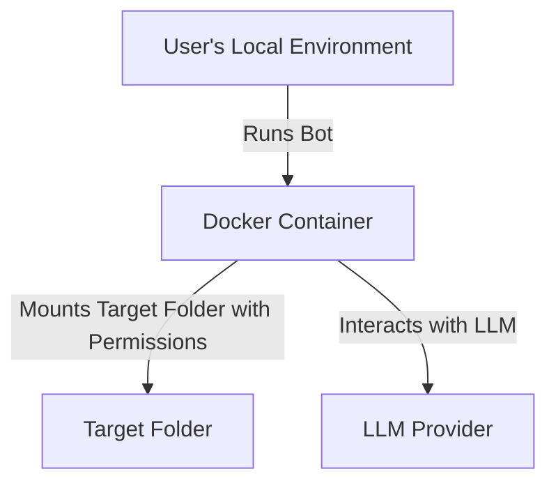

# Microbots

MicroBots is a lightweight, extensible AI agent for code comprehension and controlled file edits. It integrates cleanly 
into automation pipelines, mounting a target directory with explicit read-only or read/write modes so LLMs can safely 
inspect, refactor, or generate files with least‑privilege access.

```py
from microbots import WritingBot

myWritingBot = WritingBot(
    model="azure-openai/my-gpt5", # model format : <provider/deployment_model_name>
    folder_to_mount=str("myReactApp"),
)

data = myWritingBot.run("""when doing npm run build, I get an error. 
Fix the error and make sure the build is successful.""", timeout_in_seconds=600)
print(data.results)
```

## How to install

### Pre-requisites

- Docker
- AI LLM Provider and API Key

### Install Microbots

```bash
pip install microbots
```


## LLM Support
    
Azure OpenAI Models

```env
OPEN_AI_END_POINT=XXXXXXXXXXXXXXXXXXXXXXXXXX
OPEN_AI_KEY=XXXXXXXXXXXXXXXXXXXXXXXXXXXXXXXXXXXXXXXXXXXXXXXXXXXX
```

## Bots & Usage Examples

Pre-requisite for the below example code of Bots:   
From the root of your application, Create a folder called  `code` inside which clone the repo `https://github.com/swe-agent/test-repo/`. Now run the code


### ReadingBot


```py
from microbots import ReadingBot

myBot = ReadingBot(
    model="azure-openai/my-gpt5",
    folder_to_mount="code"
)

runResult = myBot.run("When I am running missing_colon.py I am getting SyntaxError: invalid syntax. Find the error and explain me what is the error", timeout_in_seconds=600)
print(runResult)

```

The `ReadingBot` will read the files inside `code` folder and will extract information 


### WritingBot

Pre-requisite for the example code: 
From the root the application, Create a folder called  `code` inside which clone the repo `https://github.com/swe-agent/test-repo/`. Now run the code

```py
from microbots import WritingBot

myBot = WritingBot(
    model="azure-openai/my-gpt5",
    folder_to_mount="code"
)

myBot.run("When I am running missing_colon.py I am getting SyntaxError: invalid syntax. Fix the error and make sure the code runs without any errors.", timeout_in_seconds=600)
```

## How it works

### Containerized Execution
The Bots run inside a Docker container with the target folder mounted with explicit `read-only` or `read/write` permissions. All the run time dependencies are installed inside the container and as code execution happens inside the container, so your local environment is safe.


