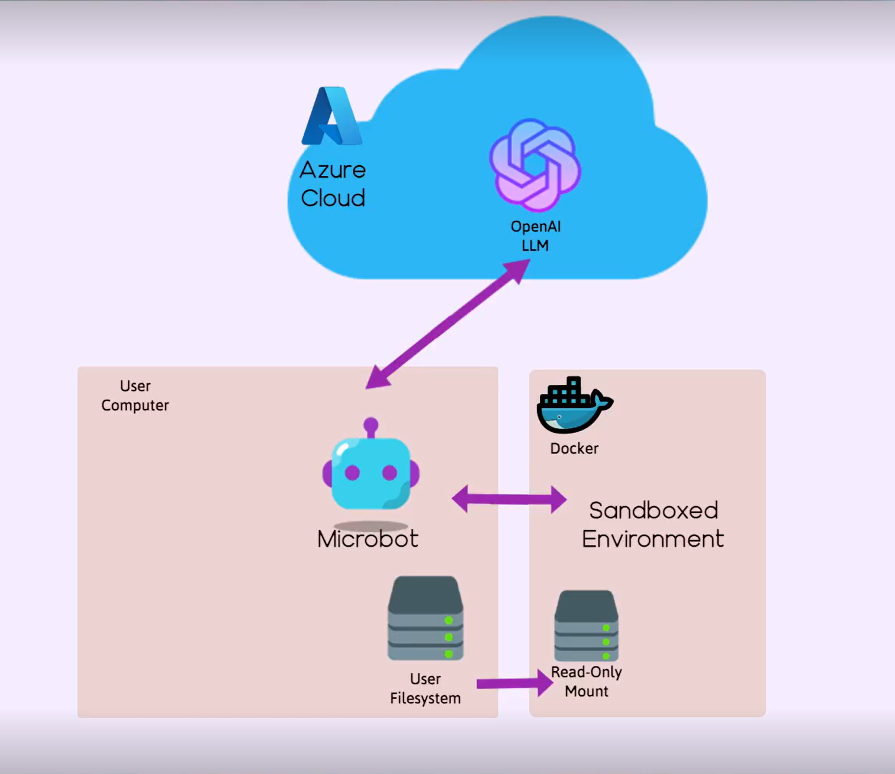

# 🤖 Microbots

MicroBots is a lightweight, extensible AI agent for code comprehension and controlled file edits. It integrates cleanly
into automation pipelines, mounting a target directory with explicit read-only or read/write modes so LLMs can safely
inspect, refactor, or generate files with least‑privilege access.

```py
from microbots import WritingBot

myWritingBot = WritingBot(
    model="azure-openai/my-gpt5", # model format : <provider/deployment_model_name>
    folder_to_mount=str("myReactApp"),
)

data = myWritingBot.run("""when doing npm run build, I get an error.
Fix the error and make sure the build is successful.""", timeout_in_seconds=600)
print(data.results)
```

## ⚠️ Project Status: Under Fast Development

This project is currently **under active development**. Features, APIs, and internal structures are subject to change across versions without notice, and unexpected behavior may occur. Please **use with caution** in production environments.

## 🚀 How to install

### Pre-requisites

- Docker
- AI LLM Provider and API Key

### Install Microbots

```bash
pip install microbots
```

## ✨LLM Support

Azure OpenAI Models - Add the below environment variables in a `.env` file in the root of your application

```env
OPEN_AI_END_POINT=XXXXXXXXXXXXXXXXXXXXXXXXXX
OPEN_AI_KEY=XXXXXXXXXXXXXXXXXXXXXXXXXXXXXXXXXXXXXXXXXXXXXXXXXXXX
AZURE_OPENAI_DEPLOYMENT_NAME=XXXXXXXXXXXXXXXXXXXXXX
```

## 🤖 Bots & Usage Examples

Pre-requisite for the below example code of Bots:
From the root of your application, Create a folder called  `code` inside which clone the repo `https://github.com/swe-agent/test-repo/`. Now run the code

### 📖 ReadingBot

```py
from microbots import ReadingBot

myBot = ReadingBot(
    model="azure-openai/my-gpt5",
    folder_to_mount="code"
)

runResult = myBot.run("When I am running missing_colon.py I am getting SyntaxError: invalid syntax. Find the error and explain me what is the error", timeout_in_seconds=600)
print(runResult)

```

The `ReadingBot` will read the files inside `code` folder and will extract information based on specific instructions given to the bot.

### ✍️ WritingBot

Pre-requisite for the example code:
From the root the application, Create a folder called  `code` inside which clone the repo `https://github.com/swe-agent/test-repo/`. Now run the code

```py
from microbots import WritingBot

myBot = WritingBot(
    model="azure-openai/my-gpt5",
    folder_to_mount="code"
)

myBot.run("When I am running missing_colon.py I am getting SyntaxError: invalid syntax. Fix the error and make sure the code runs without any errors.", timeout_in_seconds=600)
```

The `WritingBot` will read and write the files inside `code` folder based on specific instructions given to the bot.

## ⚙️ How it works



The MicroBots create a containerized environment and mount the specified directory with restricting the permissions to read-only or read/write based on Bot used. It ensures that the AI agents operate within defined boundaries which enhances security and control over code modifications as well as protecting the local environment.

## 🛠️ Local Development Setup

**Prerequisites:** Python 3.11+, Docker

**Setup:**

```bash
git clone https://github.com/microsoft/minions.git
cd minions
python -m venv .venv
source .venv/bin/activate
pip install -e ".[dev]"
```

**LLM Provider (choose any combination):**

```env
# Azure OpenAI
OPEN_AI_END_POINT=https://your-endpoint.openai.azure.com/openai/v1/
OPEN_AI_KEY=your-api-key
AZURE_OPENAI_DEPLOYMENT_NAME=gpt-5
OPEN_AI_DEPLOYMENT_NAME=gpt-5

# Anthropic
ANTHROPIC_API_KEY=your-api-key
ANTHROPIC_END_POINT=https://api.anthropic.com/
ANTHROPIC_DEPLOYMENT_NAME=claude-3-5-sonnet-20241022

# Ollama (local) - see test/llm/README_OLLAMA_TESTING.md
LOCAL_MODEL_NAME=qwen2.5-coder:latest
LOCAL_MODEL_PORT=11434
```

```env
# Required for basic tests
LOCAL_MODEL_NAME=fake_model
LOCAL_MODEL_PORT=12345

# Required for BrowserBot tests
BROWSER_USE_LLM_MODEL="gpt-5"
BROWSER_USE_LLM_TEMPERATURE=1
AZURE_OPENAI_API_KEY=your-api-key
AZURE_OPENAI_ENDPOINT=https://your-endpoint.openai.azure.com/
AZURE_OPENAI_API_VERSION="2025-01-01-preview"
```

**Run tests:**

```bash
pytest -m unit                # Fast unit tests (no Docker)
pytest -m integration         # Integration tests (requires Docker)
pytest -m "not slow"          # Skip slow tests
pytest                        # Run all tests
```
