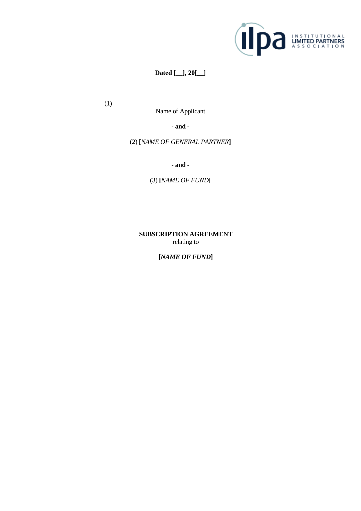

# Custom Tool Integration Walkthrough

**Published on:** April 13, 2026 | **Author:** Balakumaran Kannan

Microbots agents run inside sandboxed Docker containers with only standard Linux utilities available. But real-world tasks often demand specialized software — debuggers, core-dump analyzers, linters, compilers, database clients, and more. Instead of baking every possible tool into the base image, Microbots provides a **YAML-based tool definition system** that lets you declare custom tools which are relevant and necessary to your workflow and inject them into any agent at runtime.

This guide walks through the process by building a custom Tesseract OCR tool and using it with a `WritingBot` to extract form fields from a scanned document image.

The problem statement is simple. Given a flattened (non-Acrobat) PDF file, recognize any field elements from it and list them into a JSON file. This is useful when developing a dynamic user interface based on a form the user needs to fill.

Consider the following scanned form page:



This is a Subscription Agreement with two fillable fields: **Date** and **Name of Applicant**. The expectation from the agent is to run OCR on this image, identify these fields, and produce a JSON output listing each field along with its name, expected data type, and expected length.

You can find a sample output JSON file in the `pngs/` directory of the example. The exact output may vary based on the LLM's interpretation of the instructions and the OCR results.

## The Tool System at a Glance

Every tool in Microbots is described by a YAML file. The YAML definition is the only file you need to create — Microbots handles parsing, installation, verification, and prompt injection automatically. The tool will be installed inside the sandboxed Environment, and the LLM will use it to perform specialized operations on data or artifacts specific to your workflow.

## Anatomy of a Tool Definition

A tool YAML file supports the following fields:

| Field | Required | Description |
|---|---|---|
| `name` | Yes | Unique identifier for the tool |
| `tool_type` | Yes | `internal` (runs in sandbox) or `external` (runs on host) |
| `description` | Yes | Short description of the tool |
| `install_commands` | No | Shell commands to install the tool. Executed when the Environment is set up |
| `verify_commands` | No | Commands to confirm installation succeeded |
| `setup_commands` | No | Commands executed after code is mounted, before the LLM runs |
| `uninstall_commands` | No | Cleanup commands run during environment teardown. Can be omitted if the environment is not reused |
| `env_variables` | No | Environment variables to copy from the host into the sandbox |
| `files_to_copy` | No | Files to copy into the environment with explicit permissions |
| `parameters` | No | Parameter schema exposed to the LLM |
| `usage_instructions_to_llm` | Yes | Instructions appended to the LLM system prompt explaining how to use the tool |

The `usage_instructions_to_llm` field is critical — it is the only way the LLM knows the tool exists and how to invoke it. Though the usage instructions become part of the system prompt, they are defined alongside the tool in the YAML file. If the tool is removed, the instructions are automatically removed from the system prompt. You don't need to manually track and manage them.

## Step 1: Define the Tesseract OCR Tool

Following the table of fields above, create a file called `tesseract_ocr.yaml`:

```yaml title="tesseract_ocr.yaml" linenums="1"
--8<-- "docs/examples/tesseract_ocr_tool_use/tesseract_ocr.yaml"
```

Because `tool_type` is `internal`, every command in `install_commands` executes **inside the Docker sandbox**. The `apt-get install` never touches your host — even if it fails, only the disposable container is affected.

The `usage_instructions_to_llm` block is injected verbatim into the LLM's system prompt. Write it as if you are explaining the tool to a colleague who has shell access but has never used it before.

Since the Environment will be reaped once the job is over, it is overkill to uninstall the tool before cleaning up. So `uninstall_commands` is purposefully left out.

## Step 2: Write the Agent Script

With the YAML defined, wiring it into an agent takes only a few lines.

First, import `parse_tool_definition` — the utility that turns a YAML file into a `Tool` object:

```python title="field_extractor_agent.py" linenums="4"
--8<-- "docs/examples/tesseract_ocr_tool_use/field_extractor_agent.py:4:4"
```

Then parse the YAML into a tool object:

```python title="field_extractor_agent.py" linenums="40"
--8<-- "docs/examples/tesseract_ocr_tool_use/field_extractor_agent.py:40:42"
```

And pass it to the bot via the `additional_tools` parameter. This is a list, so you can attach multiple tools for workflows that need them:

```python title="field_extractor_agent.py" linenums="43"
--8<-- "docs/examples/tesseract_ocr_tool_use/field_extractor_agent.py:43:47"
```

Here is the complete agent script:

```python title="field_extractor_agent.py" linenums="1"
--8<-- "docs/examples/tesseract_ocr_tool_use/field_extractor_agent.py"
```

### What Happens Under the Hood

1. **`parse_tool_definition`** reads the YAML, inspects the `tool_type` field, and returns a `Tool` instance.
2. **`WritingBot`** mounts the `pngs/` directory as `READ_WRITE` inside the sandbox, giving the agent access to the image files.
3. During environment setup, Microbots runs each `install_commands` entry inside the container — here, that installs the `tesseract-ocr` package.
4. The `usage_instructions_to_llm` text is appended to the LLM's system prompt, so the model knows it can invoke `tesseract` commands.
5. The LLM autonomously runs `tesseract` on the mounted image, parses the output, and produces the requested JSON.

## Step 3: Run It

Place your image files in a `pngs/` directory alongside the script and YAML:

```
project/
├── field_extractor_agent.py
├── tesseract_ocr.yaml
└── pngs/
    └── pdf_page-01.png
```

Then execute:

```bash
python field_extractor_agent.py
```

The agent will install Tesseract inside the sandbox, run OCR on the image, and produce structured JSON output — all without installing anything on your host.

Here is the output it has produced in my run.

```json title="extracted_fields.json" linenums="1"
--8<-- "docs/examples/tesseract_ocr_tool_use/pngs/extracted_fields.json"
```

*Note: The output may vary based on the LLM's interpretation of the instructions and the OCR results. When you want to try this example yourself. Delete this output file before running the Agent.*

## Writing Effective Tool Definitions

A few patterns from the built-in Microbots tools:

### Keep `usage_instructions_to_llm` Non-Interactive

Microbots scaffolding executes each command the LLM produces in a shell, captures the output, and sends it back to the LLM as part of the next ReAct loop iteration. This means the shell must run to completion and return output for the loop to advance. Any command that opens an interactive prompt or TUI — such as `vim`, `less`, or an interactive `cscope` session — will block the shell indefinitely, stalling the entire agent.

So, always instruct the LLM to use non-interactive, batch, or CLI modes. For example, the built-in `cscope` tool definition explicitly states:

> Do NOT run interactive `cscope` (no curses UI). Use the `-L` batch mode flags.

### Use `files_to_copy` for Helper Scripts

If your tool requires a wrapper script or configuration file, use `files_to_copy` to place it inside the container with the right permissions. This lets you ship arbitrarily complex logic as a simple command the LLM can call.

### Use `env_variables` for Secrets

Listed environment variables are copied from the host into the sandbox at runtime. This keeps secrets out of YAML files while ensuring the tool has what it needs.

### Add `verify_commands` for Reliability

If your install is non-trivial, add verification commands. Microbots will confirm each succeeds before declaring the tool ready:

```yaml
verify_commands:
  - tesseract --version
```

## Summary

Custom tools in Microbots follow a simple pattern:

1. **Define** the tool in a YAML file with install commands and LLM instructions.
2. **Parse** the YAML with `parse_tool_definition()`.
3. **Attach** the tool to any bot via the `additional_tools` parameter.
4. **Run** the agent — Microbots handles installation, prompt injection, and sandboxing.

The YAML-based approach keeps tool definitions portable, version-controllable, and decoupled from agent logic. You can share tool definitions across teams, compose multiple tools in a single agent, and swap tools without changing a line of Python.