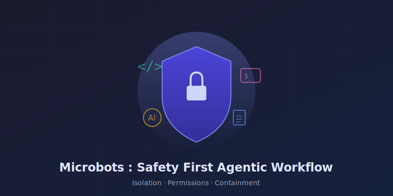

# Blogs

## Latest Posts

<a href="microbots-safety-first-ai-agent/">

Apr 3, 2026

Microbots : Safety First Agentic Workflow

Autonomous AI coding agents are powerful — but power without guardrails is a liability. Learn how Microbots tackles safety through 5 reinforcing layers: container isolation, OverlayFS, permission labels, dangerous command detection, and iteration budgets...

</a>

