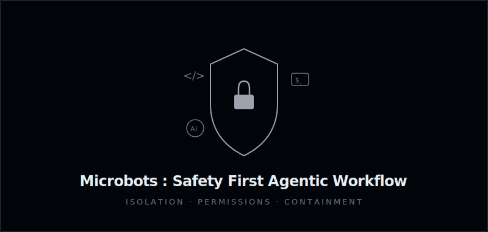
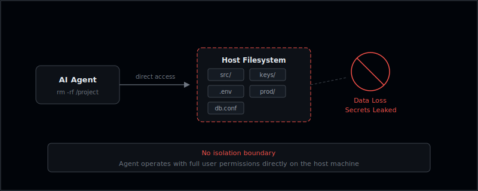
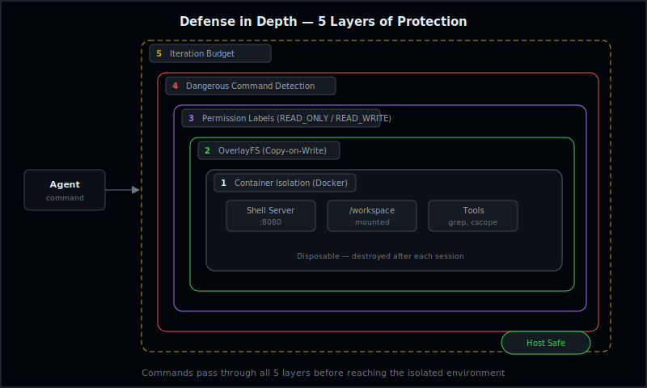
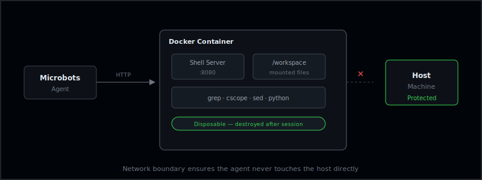
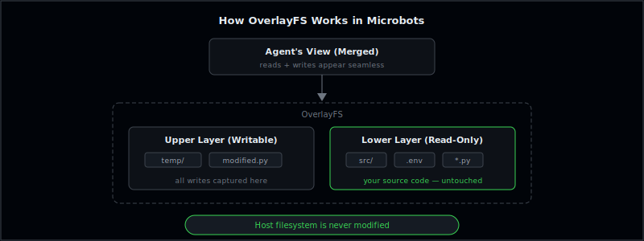
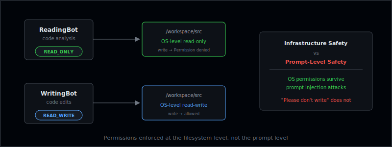
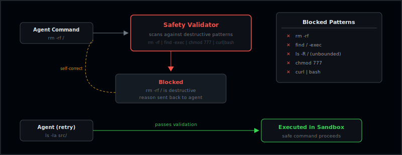
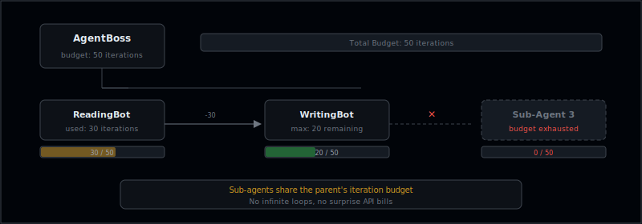

# Microbots : Safety First Agentic Workflow

**Published on:** April 3, 2026 | **Last Edited:** April 3, 2026 | **Author:** Siva Kannan

Autonomous AI coding agents are powerful — but power without guardrails is a liability. An agent that can write code, execute shell commands, and modify files is one misinterpreted instruction away from deleting a production database or leaking secrets. Microbots was built with a core conviction: **safety is not just a feature — it is the foundation**.

This post walks through how Microbots tackles the fundamental safety challenges of agentic workflows through five reinforcing layers of protection.

## The Problem: Unconstrained Agents

Most AI coding tools operate directly on the host filesystem with no isolation boundary. When an LLM-powered agent gains the ability to execute arbitrary commands, the risk profile changes dramatically.

Imagine an agent tasked with fixing a failing test. It decides the fix requires restructuring a directory and runs `rm -rf` on what it believes is a temporary folder — except it misidentified the path. Without guardrails, that command executes against your real filesystem with your real permissions. The damage is immediate and irreversible.

Microbots was designed from day one to make this scenario impossible.

## How Microbots Tackles It: 5 Layers of Defense

1. **Container Isolation** — Every command runs inside a disposable Docker container
2. **OverlayFS for Read-Only Safety** — Copy-on-write filesystem keeps host files untouched
3. **Permission Labels** — OS-level READ_ONLY / READ_WRITE enforcement per mount
4. **Dangerous Command Detection** — Safety validator blocks destructive patterns before execution
5. **Iteration Budget Management** — Sub-agents share a finite compute budget to prevent runaway costs

### 1. Container Isolation

Microbots never lets an agent touch the host machine directly. Every command — whether it's `grep`, `sed`, or even a dangerous `rm -rf` — executes inside a **disposable Docker container**. The container runs a lightweight shell server that accepts commands over HTTP, creating a clear network boundary between the agent and your system.

If the agent executes a destructive command, only the disposable container is affected. Your host machine, your files, your credentials — all untouched. When the session ends, the container is destroyed. No cleanup needed all evidence of the agent's work lives and dies in the sandbox.

### 2. OverlayFS for Read-Only Safety

When an agent only needs to read source code, a naive read-only mount would prevent it from doing any work — it cannot write intermediate files, temp outputs, or tool artifacts. Microbots solves this with **OverlayFS**, a copy-on-write filesystem borrowed from how Linux live CDs work.

OverlayFS presents two layers to the container: a **read-only lower layer** containing your original source code, and a **writable upper layer** that captures all modifications. The agent perceives a fully writable environment, but every write goes to the upper layer. Your host filesystem remains completely untouched. This pattern is surprisingly rare in AI agent frameworks, yet it is the most elegant solution to the read-vs-write dilemma.

### 3. Permission Labels as First-Class Concepts

Microbots enforces a clear permission model where `READ_ONLY` and `READ_WRITE` are **explicit labels attached to every mounted folder**. This is not prompt-level safety — it is infrastructure-level safety.

A `ReadingBot` physically cannot write to the codebase because its mount permissions make it impossible at the OS level. Relying on the LLM to "know" it should not modify files is hoping for the best. Enforcing it through filesystem permissions is guaranteeing it. The latter survives prompt injection attacks; the former does not.

### 4. Dangerous Command Detection

Before any command reaches the sandbox, Microbots runs it through a **safety validator** that scans against known destructive patterns: recursive deletions (`rm -rf`), unbounded `find` commands, recursive directory listings that could produce gigabytes of output, and more.

Blocked commands are not silently dropped. Instead, the agent receives a clear explanation of why the command was rejected along with a **suggested safer alternative**. This teaches the LLM to self-correct rather than merely constraining it — turning safety enforcement into a learning loop.

### 5. Iteration Budget Management

When a parent agent delegates work to sub-agents, each sub-agent draws from the **parent's iteration budget**. If the parent allocates 50 iterations total and a sub-agent has used 30, the next sub-agent can only use 20.

This prevents a runaway sub-agent from consuming unbounded compute — a critical safeguard when LLM API calls are priced per token. Cost safety is often overlooked, but in production agentic workflows, an infinite loop of API calls can be just as damaging as a destructive command.

## The Microbots Principle

The core philosophy behind Microbots is simple: **assume the LLM will eventually produce a harmful command, and architect your system so that it does not matter when it does**.

- Prompts are suggestions. Sandboxes are guarantees.
- Isolation must be structural, not behavioral.
- Permissions must be enforced by the OS, not by the system prompt.
- Cleanup must be automatic, not dependent on the agent remembering to tidy up.

## Looking Forward

As AI agents gain capabilities like web browsing, database access, and deployment automation, the attack surface expands proportionally. Frameworks that bolt on safety as an afterthought will face increasingly severe failure modes. Microbots proves that you do not have to choose between capability and safety — with the right architecture, you get both.

**Safety is not just a feature. It is the foundation everything else is built on.**
